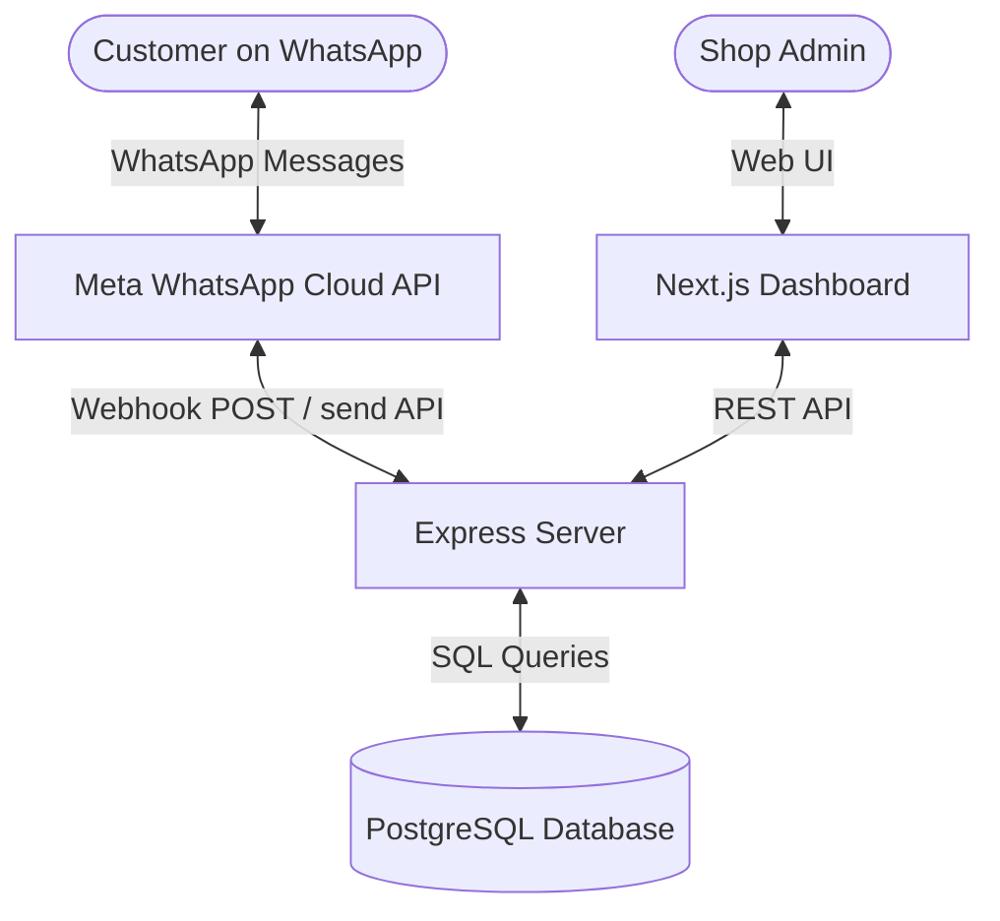

# Architecture Blueprint

## 1. System Overview
The application consists of three main blocks:
1. **WhatsApp Chatbot (Express Server):** Listens to webhook events from the Meta API, updates the database, and responds with interactive catalog or button templates.
2. **Admin Dashboard (Next.js):** Provides a visual UI for the shop manager to create products, view orders, and manage delivery partners.
3. **Database (PostgreSQL on Railway):** Stores customers, orders, inventory, and transaction logs.

---

## 2. Subsystems

### A. WhatsApp Webhook & Bot Engine
- **Files:** `server/src/routes/webhook.js`, `server/src/services/whatsapp.js`
- **Responsibilities:**
  - Verify webhook challenges (`hub.verify_token`).
  - Receive messages (text, list response, button response, address, catalog).
  - Implement chat logic (cart management, address storing, order finalization).
  - Deduplicate incoming messages using the database to prevent duplicate responses.

### B. Admin API
- **Files:** `server/src/routes/products.js`, `server/src/routes/orders.js`, `server/src/routes/partners.js`
- **Responsibilities:**
  - Expose JSON endpoints for Next.js panel.
  - Handle product creation (and variants).
  - Handle order status updates and partner management.

### C. Frontend Dashboard
- **Files:** `admin-dashboard/app/`
- **Pages:**
  - `/` (Overview metrics)
  - `/products` (Catalog list, upload form)
  - `/orders` (Order list, status updating, details)
  - `/partners` (Delivery agent registration & status - *missing*)
  - `/settings` (Store settings & credentials - *missing*)

---

## 3. Data Models (Key Tables)
- **customers:** Stores customer phone numbers and metadata.
- **addresses:** Shipping addresses per customer.
- **products & product_variants:** Weight-based variants (e.g., 500g milk, 1kg curd) with individual prices and stock limits.
- **orders & order_items:** Tracks total amount, order state (PENDING_PAYMENT, CONFIRMED, DELIVERED, etc.), and itemized variants bought.
- **delivery_partners & order_assignments:** Tracks active riders and assignments.
