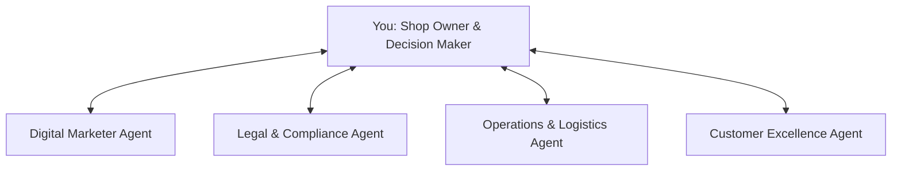

# Business & Go-To-Market (GTM) Strategy: Mera Kirana

This document serves as the strategic roadmap for launch, marketing, marketplace distribution, and scaling of the Mera Kirana dairy shop automation.

---

## 1. Go-To-Market (GTM) Launch Strategy
A local dairy shop has a high-frequency, location-bound customer base. The primary GTM objective is to migrate existing walk-in/call-in customers to the automated WhatsApp channel, then expand in the local neighborhood.

### Phase 1: Local Migration (Organic)
- **In-Store QR Codes:** Place clear, visual tent cards at the checkout counter: *"Skip the queue. Order fresh milk & curd on WhatsApp. Scan to start."*
- **Pamphlet Insertion:** Print small leaflets and drop them in the morning newspaper deliveries in neighboring housing complexes.
- **Broadcast Notification:** If you have an existing list of customer phone numbers, send a one-time broadcast introducing the WhatsApp service with a quick action button.

### Phase 2: Hyper-Local Performance Marketing (Inorganic)
- **Meta Click-to-WhatsApp Ads:**
  - **Concept:** Ads on Facebook and Instagram featuring a "Send Message" button that opens WhatsApp directly.
  - **Targeting:** Narrow geographical radius (within 2-3 km of the shop), targeting households and parents interested in fresh organic milk/dairy.
  - **Hook:** Offer a first-order discount (e.g., *"Get 10% off your first delivery"*).
- **Google Maps Ads:** Optimize Google My Business listing for local keywords ("fresh milk near me", "curd delivery") with a call-to-action directing to the WhatsApp booking link.

---

## 2. Marketplace & Aggregator Integrations
While WhatsApp acts as your direct-to-consumer (D2C) channel (retaining 100% of margins), aggregators can expand your reach.

### A. Swiggy Minis
- **What it is:** A low-commission marketplace built inside Swiggy for local brands.
- **Why it fits:** Perfect for a local dairy shop to list packs of cheese, ghee, paneer, or dairy sweets. It handles logistics and payments without charging high commissions like main Swiggy Food.

### B. ONDC (Open Network for Digital Commerce)
- **What it is:** India's open network allowing you to list products once and be visible across buyer apps like Paytm, Pincode (PhonePe), and Magicpin.
- **Why it fits:** Extremely cheap transaction commissions, enabling direct competition with big grocery apps in your neighborhood.

---

## 3. Specialized Business Advisor Roles (Agentic Strategy)
For a successful scale-up, you will consult specialized virtual agents. Here is how their roles are defined:

### A. Digital Marketer Agent
- **Focus:** Performance ads optimization, local search ranking, WhatsApp broadcast scheduling, and CAC (Customer Acquisition Cost) calculations.
- **Guidance:** Setting budget caps on Meta Ads, creating ad copy (e.g., *“Fresh milk delivered at 7:00 AM daily”*), and tracking conversion rates.

### B. Legal & Compliance Agent
- **Focus:** Licensing, labeling laws, and consumer protection.
- **Guidance:** Getting FSSAI registration (mandatory for food/dairy in India), drafting refund/cancellation policies, and ensuring clean billing layouts.

### C. Operations & Logistics Agent
- **Focus:** Delivery partner dispatching and inventory safety.
- **Guidance:** Designing optimal delivery slots (e.g., 6:30 AM - 8:30 AM), assigning partner routes, and setting stock thresholds for dairy variants to prevent selling expired stock.

### D. Customer Excellence Agent
- **Focus:** Post-purchase experience, feedback collection, and grievance handling.
- **Guidance:** Standardizing replies for damaged goods (e.g., sour milk refunds), loyalty reward configurations, and broadcast flows.
