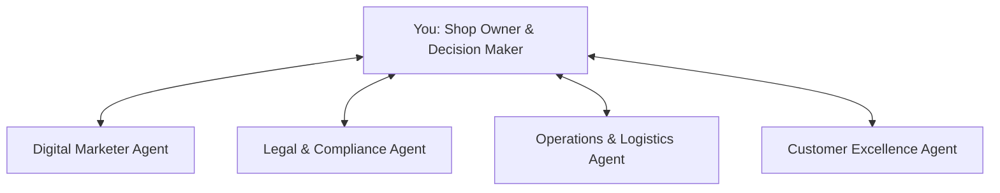

# Business & Go-To-Market (GTM) Strategy: Mera Kirana

This document serves as the strategic roadmap for launch, marketing, marketplace distribution, and scaling of the Mera Kirana dairy shop automation.

> **Advisor review 2026-09-09 (critical):** Don't out-Blinkit Blinkit. Win on fresh-perishable + sweets/custom + trust/credit + subscriptions. No packaged goods. WhatsApp = retention channel, not acquisition — the counter QR is the real storefront. Multi-shop SaaS only after one paid pilot proves revenue. Shop owns its data (DPDP Act); we are the processor. Model: base fee covering Meta/hosting + % on tracked repeat/campaign sales.

---

## 0. Positioning: Why WhatsApp When Blinkit Exists

- **Never compete head-on.** Blinkit wins on 10-min delivery, 10k SKUs, discovery. We win on three things it cannot do:
  1. **Made-fresh today** — morning paneer, hot mawa sweets, home-set curd, custom orders (less sweet, 1 kg for tomorrow's party). Perishable + local + custom only. If Blinkit can stock it, we don't sell it.
  2. **Trust + khata** — "same as last time, pay Friday." Neighborhood credit ledger, repeat shortcuts, owner on chat.
  3. **Subscriptions as habit** — daily milk/curd on autopilot beats any app reminder.
- **Assortment rule:** fresh dairy + sweets + festive pre-orders only. No packaged foods, ever.
- **Channel truth:** customers don't "come to WhatsApp." They come from the counter (QR tent card), the society gate, bag inserts, referrals. Budget 80% of early effort on counter habit, not ads.

## 1. Go-To-Market (GTM) Launch Strategy
A local dairy shop has a high-frequency, location-bound customer base. The primary GTM objective is to migrate existing walk-in/call-in customers to the automated WhatsApp channel, then expand in the local neighborhood.

### Phase 1: Local Migration (Organic)
- **In-Store QR Codes:** Place clear, visual tent cards at the checkout counter: *"Skip the queue. Order fresh milk & curd on WhatsApp. Scan to start."*
- **Pamphlet Insertion:** Print small leaflets and drop them in the morning newspaper deliveries in neighboring housing complexes.
- **Broadcast Notification:** If you have an existing list of customer phone numbers, send a one-time broadcast introducing the WhatsApp service with a quick action button.

### Phase 2: Hyper-Local Performance Marketing (Inorganic)
- **Meta Click-to-WhatsApp Ads:**
  - **Concept:** Ads on Facebook and Instagram featuring a "Send Message" button that opens WhatsApp directly.
  - **Targeting:** Narrow geographical radius (within 2-3 km of the shop), targeting households and parents interested in fresh organic milk/dairy.
  - **Hook:** Offer a first-order discount (e.g., *"Get 10% off your first delivery"*).
- **Google Maps Ads:** Optimize Google My Business listing for local keywords ("fresh milk near me", "curd delivery") with a call-to-action directing to the WhatsApp booking link.

---

## 2. Marketplace & Aggregator Integrations
While WhatsApp acts as your direct-to-consumer (D2C) channel (retaining 100% of margins), aggregators can expand your reach.

### A. Swiggy Minis
- **What it is:** A low-commission marketplace built inside Swiggy for local brands.
- **Why it fits:** Perfect for a local dairy shop to list packs of cheese, ghee, paneer, or dairy sweets. It handles logistics and payments without charging high commissions like main Swiggy Food.

### B. ONDC (Open Network for Digital Commerce)
- **What it is:** India's open network allowing you to list products once and be visible across buyer apps like Paytm, Pincode (PhonePe), and Magicpin.
- **Why it fits:** Extremely cheap transaction commissions, enabling direct competition with big grocery apps in your neighborhood.

---

## 3. Specialized Business Advisor Roles (Agentic Strategy)
For a successful scale-up, you will consult specialized virtual agents. Here is how their roles are defined:

```mermaid
graph TD
    User[You: Shop Owner & Decision Maker] <--> MarketingAgent[Digital Marketer Agent]
    User <--> LegalAgent[Legal & Compliance Agent]
    User <--> OpsAgent[Operations & Logistics Agent]
    User <--> CustAgent[Customer Excellence Agent]
```

### A. Digital Marketer Agent
- **Focus:** Performance ads optimization, local search ranking, WhatsApp broadcast scheduling, and CAC (Customer Acquisition Cost) calculations.
- **Guidance:** Setting budget caps on Meta Ads, creating ad copy (e.g., *“Fresh milk delivered at 7:00 AM daily”*), and tracking conversion rates.

### B. Legal & Compliance Agent
- **Focus:** Licensing, labeling laws, and consumer protection.
- **Guidance:** Getting FSSAI registration (mandatory for food/dairy in India), drafting refund/cancellation policies, and ensuring clean billing layouts.

### C. Operations & Logistics Agent
- **Focus:** Delivery partner dispatching and inventory safety.
- **Guidance:** Designing optimal delivery slots (e.g., 6:30 AM - 8:30 AM), assigning partner routes, and setting stock thresholds for dairy variants to prevent selling expired stock.

### D. Customer Excellence Agent
- **Focus:** Post-purchase experience, feedback collection, and grievance handling.
- **Guidance:** Standardizing replies for damaged goods (e.g., sour milk refunds), loyalty reward configurations, and broadcast flows.

---

## 4. Pilot Checklist: Own Shop First (Before Any SaaS Sale)

Prove this at Khandelwal Traders before onboarding shop #2. Targets: 60 days.

- [ ] 50+ real WhatsApp orders completed end-to-end (browse → cart → address → slot → pay → delivered).
- [ ] ≥30% of revenue from repeat/subscription (repeat shortcut + subscription schedules working).
- [ ] Zero catalog parse failures for 14 straight days (retailer IDs synced; seed script re-run documented).
- [ ] Counter kit live: QR tent card, bag inserts, delivery-bag sticker, first-order offer (free sweet) + subscription discount.
- [ ] DND compliance clean: every broadcast has STOP/START honored; no Meta ban/warning.
- [ ] Unit math known: Meta conversation cost/order, Razorpay fee share (push COD where possible), delivery cost/order, refund rate.
- [ ] One festive pre-order run (e.g., Diwali sweets) executed via campaigns + coupon tracking.

## 5. Multi-Shop SaaS Model (Deferred — After Pilot)

- **Status:** Deferred by owner decision 2026-09-09. Phase 4 spec only after one paid pilot validates pricing.
- **Pricing (proposed):** ₹0 setup + base ~₹1,500/shop/month (covers Meta conversation + hosting costs) + 5–8% of tracked repeat/campaign-attributed sales (coupon/referral codes). Base keeps lights on; percentage aligns incentives. No upfront software fee before proven orders.
- **Data ownership:** each shop owns its customer data; we are the data processor under contract (DPDP Act compliance). Moat = playbook + shared festival templates + network learnings, never holding shops' data hostage.
- **Technical precondition:** full tenant isolation (separate shop_id scoping on every table, per-shop catalog/token/settings) — one data leak and every shop churns.
- **Sequencing:** (1) own shop proves +20–30% repeat revenue 60 days → (2) one free-30-day pilot shop, success-fee only, learn second-catalog/second-rider breakage → (3) then build Phase 4 billing + isolation.
- **Cost heads to price in:** Meta per-conversation fees (~₹0.5–1 marketing message), Razorpay ~2% + GST on online links, delivery ops, 24-h window limits on broadcasts.
